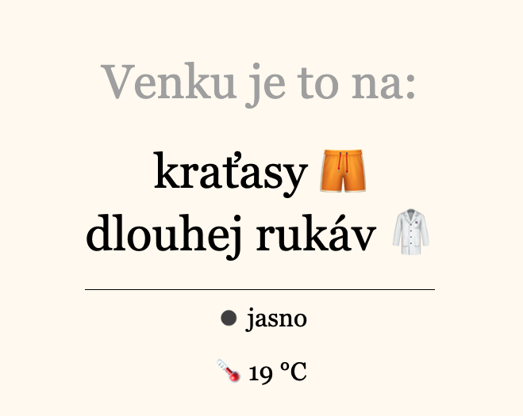

<div id="top"></div>

<!-- PROJECT LOGO -->
<br />
<div align="center">

  <h3 align="center">weather-for-humans</h3>

  <p align="center">
    Check what to wear. Now.
    <br />
    <a href="https://pocasi-pro-lidi.cz/"><strong>https://pocasi-pro-lidi.cz/</strong></a>
    <br />
    <br />
    <a href="https://github.com/lipelix/weather-for-humans/issues">Report Bug</a>
    ·
    <a href="https://github.com/lipelix/weather-for-humans/issues">Request Feature</a>
  </p>
</div>


<!-- ABOUT THE PROJECT -->
## About The Project

<!-- [![Product Name Screen Shot][product-screenshot]](assets/app-screen.png) -->

There are many great weather apps which tells you every little detail about moisture, waves height and so on. But let's be honest, you don't care. Only thing you need is answer question <strong>"What should I wear ?"</strong> - this app brings answer for that. 

<p align="right">(<a href="#top">back to top</a>)</p>


### Built and Deploy

This project is build with express on backend, vanilla javascript on frontend and is deployed on heroku dynos. It levarages usage of https://openweathermap.org/ API to get weather data and custom mapping of those conditions to clothes.


<p align="right">(<a href="#top">back to top</a>)</p>


<!-- GETTING STARTED -->
## Getting Started

You can run this project locally (even if it doesn't make much sense :).

### Prequisities

* openssl
* npm (Node.js)

### Installation

1. Generate a free API Key at [https://home.openweathermap.org/api_keys](https://home.openweathermap.org/api_keys)
2. Clone the repo
   ```sh
   git clone https://github.com/lipelix/weather-for-humans.git
   ```
3. Install NPM packages
   ```sh
   npm install
   ```
4. Rename `.env.example` to `.env` in root project folder and fill `OPENWEATHER_API_KEY` with your API key from step 1.
   ```
   OPENWEATHER_API_KEY=<your api key from openweathermap>
   ```
5. Run `npm run local:generate:cert` to generate `key.pem` and `cert.pem` with `openssl` tool (details https://nodejs.org/api/https.html#httpscreateserveroptions-requestlistener)
6. Run your app by `npm run dev`

<p align="right">(<a href="#top">back to top</a>)</p>


<!-- USAGE EXAMPLES -->
## Usage

This is very easy. Just open https://pocasi-pro-lidi.cz/ .

<br />



<p align="right">(<a href="#top">back to top</a>)</p>


<!-- ROADMAP -->
## Roadmap

- [x] Deploy project
- [x] Add Support for men clothes
- [ ] Add Support for women clothes (this will be tought)
- [ ] Use React for frontend
- [ ] Multi-language Support
    - [x] Czech
    - [ ] English

<p align="right">(<a href="#top">back to top</a>)</p>

<!-- CONTACT -->
## Contact

Libor Váchal - [LinkedIn](https://www.linkedin.com/in/liborvachal/)

Project Link: [https://github.com/lipelix/weather-for-humans](https://github.com/lipelix/weather-for-humans)

<p align="right">(<a href="#top">back to top</a>)</p>


<!-- ACKNOWLEDGMENTS -->
## Acknowledgments

Usefull links and another things worth to mention.

* [OpenWeatherMap](https://openweathermap.org/api)
* [HTTPS Node.js locally](https://nodejs.org/en/knowledge/HTTP/servers/how-to-create-a-HTTPS-server/)
* [Readme template](https://github.com/othneildrew/Best-README-Template)

<p align="right">(<a href="#top">back to top</a>)</p>
